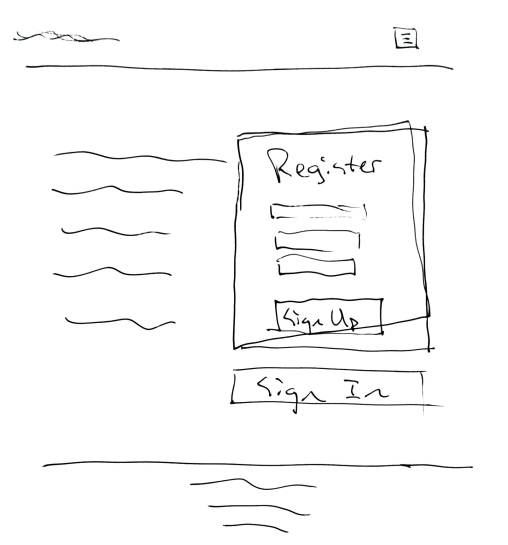
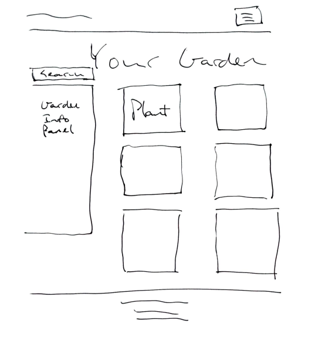
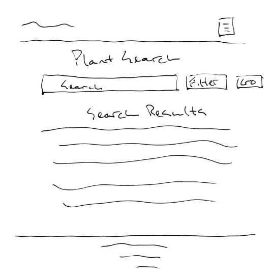
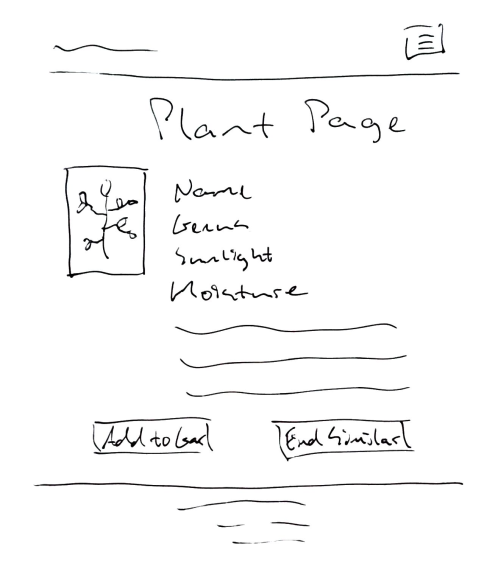

# Fancy Plants

Fancy Plants allows you to create a virtual garden for all of your plants, get in-depth information on plant care, and share your personal garden with other house plant enthusiasts.

Take a break from social media, work, and the news for a while and just focus on the things you love - plants!

## Technologies

| | | | | |
|-|-|-|-|-|
|**Front-End**|React|ES6|CSS3||
|**Back-End**|Node.js|Express|PostgreSQL|RESTful API|
|**Development**|Jest|Mocha|Chai|Heroku|
| | | | | |

## UX, User Stories & Routes

### Landing Page - GET /

- As a user, I want log in so I can access my garden
- As a new user, I want to sign up so I can create a garden

### User Garden - GET /garden/:user_id

- As a user, I want to see my garden so I can learn about the plants in it
- As a user, I want to see garden details so I can understand it as a whole object
- As a user, I want to add new plants to my garden so I can track plants I own or better visualize plants I might own

### Plants Search Page - GET /plant

- As a user, I want to search the available plants in the database so I can add them to my garden
- As a user, I want to filter my search results so I can more easily find the plant I want

### Plant Page - GET /plant/:plant_id

- As a user, I want to learn about a plant so I can decide whether to add it to my garden
- As a user, I want to add a plant to my garden so I can track the plants I own
- As a user, I want to see similar plants so I can discover new plants I might like to own

## Site Map / User Flow

- Register/Sign In 
    - My Garden 
        - Search Plants 
            - Plant Page 
                - Add Plant

## Database Architecture

## Business Objects
<!-- The basic objects required for the application -->
- Users
    - ID
    - Username
    - Password
    - Garden

- User_Garden
    - Plant_ID

- Plants
    - ID
    - Name
    - Scientific Name
    - Order
    - Native Status
    - Propagation
    - Soil
    - Duration
    - Growth
        - Temperature Minimum
        - Shade Tolerance
        - Resprout Ability
        - Drought Tolerance
        - Root Depth Minimum
    - ImageURL

## Developer Roadmap

1. Users can add comments to their plants
2. Users can search for other users' gardens via GET /garden
3. Users can leave comments on other users' gardens