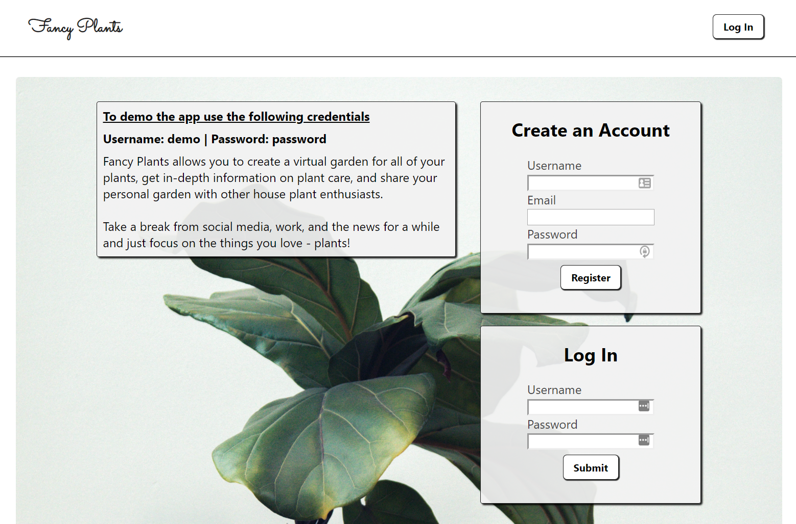
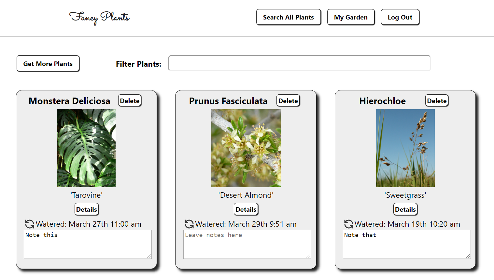
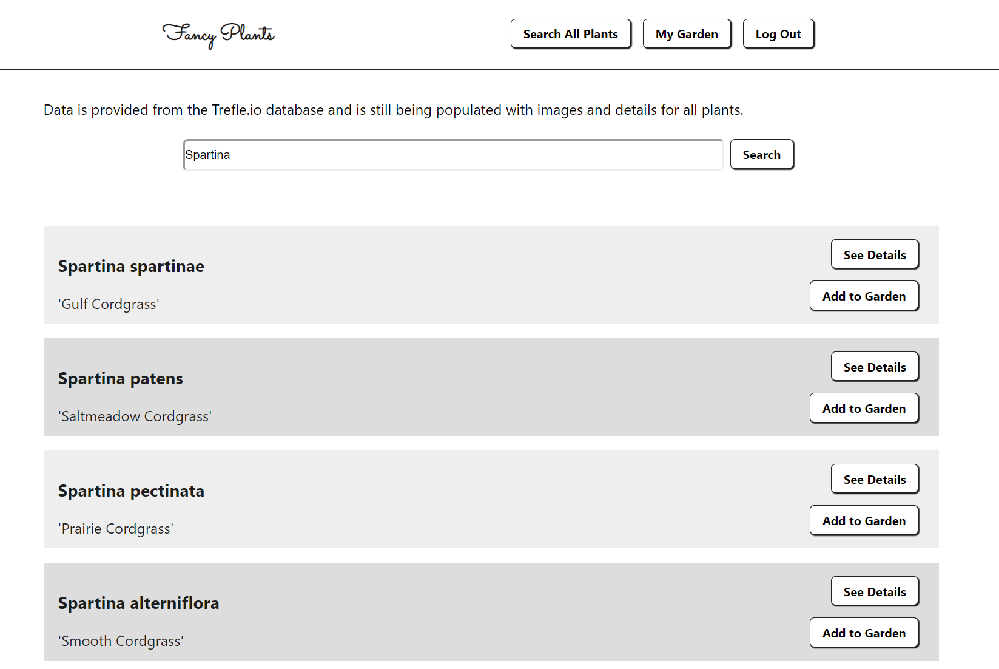
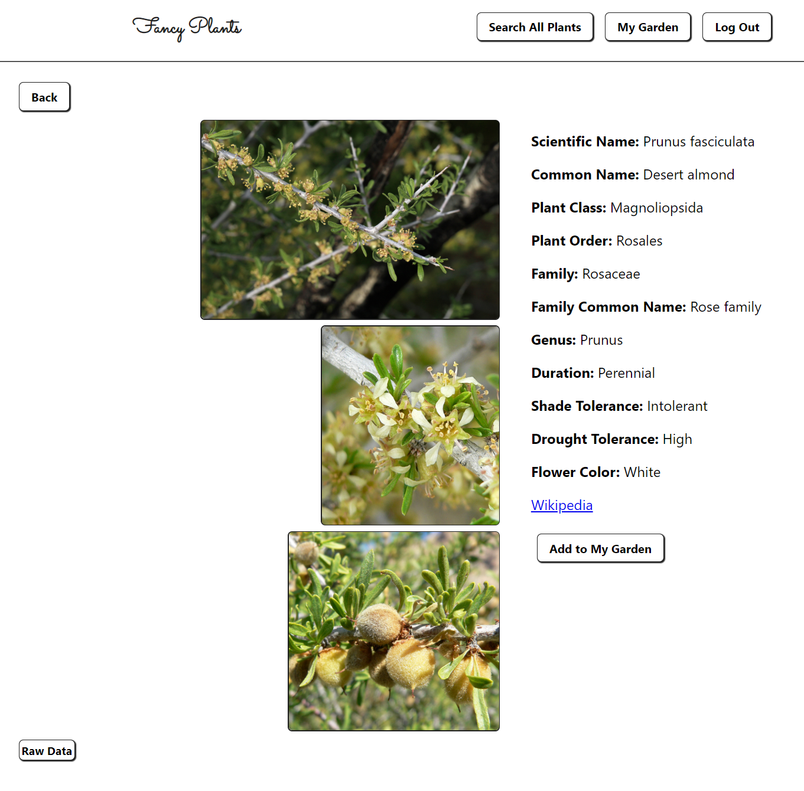

# Fancy Plants

Fancy Plants is a plant management application for tracking a collection of plants, with access to one of the largest open plant databases on the web. Users can do research on plant species, add them to their collection, and use the features of the Garden dashboard to manage their plants.

[Demo](https://fancy-plants.pmnord.now.sh/)

[Backend Documentation](https://github.com/pmnord/plant-management-react-capstone-server)

| | | | | |
|-|-|-|-|-|
|**Front-End**|React|ES10|CSS3||
|**Back-End**|Node.js|Express|PostgreSQL|RESTful API|
|**Development**|Jest|Mocha|Chai|Heroku|Zeit|
| | | | | |

## Views & Routes

### Landing Page - /

FancyPlants requires account registration to log in.

### User Garden - /garden

Manage the plants in your collection from the garden dashboard.

### Plants Search Page - /plant

Search one of the largest open plant databases on the web, Trefle.io, to learn about plants and add them to your collection.

### Plant Page - /plant/:plant_id

View images and details related to a plant on its details page.

## Site Map / User Flow

- Register/Sign In 
    - My Garden 
        - Search Plants 
            - Plant Page 
                - Add Plant

## Developer Roadmap

1. Users can search for other users' gardens via GET /garden/:username
1. Users can leave comments on other users' gardens
1. Users can track the watering history of their plants
1. Many new features to the garden dashboard
